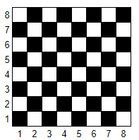

# 1.3-Python-Review - if/elif/else

## Python Review Notes
[Notes](https://drive.google.com/drive/folders/1qjB9FMWxZHhXOouDr0D22zN7S0-rF4_w?usp=sharing)

## Ascending
**Objective**: Write a Python script that checks if the digits of a three-digit integer are in strictly ascending order from left to right.

### Instructions:

**Input Collection**

- Prompt the user to enter a three-digit integer X where all digits are distinct.

**Digit Comparison**
- Extract the hundreds, tens, and ones digits from the integer X.
- Compare these digits to determine if they are in strictly ascending order from left to right.

**Output**
- Print True if the digits of X are in ascending order.
- Print False if the digits are not in ascending order.

**Example**
- For X = 123, the output should be True because 1 < 2 < 3.
- For X = 321, the output should be False because the digits are in descending order.
- For X = 132, the output should be False because the digits are not in ascending order.

## Count Equal Integers
**Objective**
Write a Python script to determine how many of three given integers are equal to each other.

### Instructions:
**Input Collection**
- Prompt the user to enter three integers.

**Comparison**
- Compare the three integers to determine how many of them are equal to each other.

**Output**
- Print 3 if all three integers are the same.
- Print 2 if exactly two of the integers are equal and the third one is different.
- Print 0 if all three integers are different.

**Example**
- For input 5, 5, 5, the output should be 3 because all three integers are the same.
- For input 4, 4, 7, the output should be 2 because two of the integers are equal, and the third one is different.
- For input 1, 2, 3, the output should be 0 because all three integers are different.

##  Chessboard
**Objective**
Write a Python script to determine if two given squares on a chessboard are painted the same color.

## Instructions
**Input Collection**
- The program receives four integers, each between 1 and 8:
    - The first two integers represent the column and row number of the first square.
    - The last two integers represent the column and row number of the second square.

**Color Determination**
- Determine the color of each square using its column and row numbers:

**Output**
- Print True if the two squares are the same color.
- Print False if they are different colors.

**Example**
- For input 1, 1, 2, 2, the output should be "YES" because both squares (1, 1) and (2, 2) are black.
- For input 1, 1, 2, 3, the output should be "NO" because square (1, 1) is black and square (2, 3) is white.

## Queen Move
**Objective**:
Write a Python script to determine whether a chess queen can move from one square to another on the chessboard in a single move.

## Instructions:
**Input Collection**
- The program receives four integers, each between 1 and 8:
    - The first two integers represent the column and row number of the first square.
    - The last two integers represent the column and row number of the second square.
    
**Move Determination**
- A queen on a chessboard can move any number of squares horizontally, vertically, or diagonally.
- Determine if the queen can move from the first square to the second square in one move.

**Output**
- Print True if the queen can move from the first square to the second square in one move.
- Print False if the queen cannot reach the second square in one move.

**Example**
- For input 1, 1, 1, 8, the output should be "YES" because the queen can move vertically from (1, 1) to (1, 8).
- For input 1, 1, 8, 8, the output should be "YES" because the queen can move diagonally from (1, 1) to (8, 8).
- For input 1, 1, 2, 3, the output should be "NO" because the queen cannot reach (2, 3) from (1, 1) in one move.